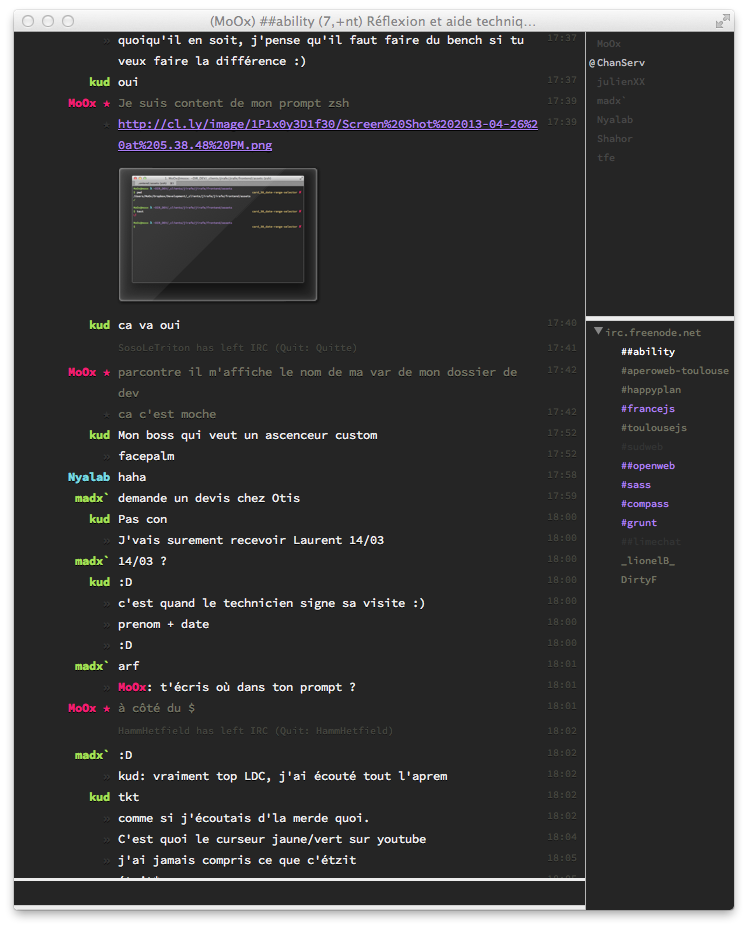

# LimeChat Monokai Soda

A LimeChat Monokai Soda theme, base on the [Monokai Soda color scheme](https://github.com/buymeasoda/soda-theme/#bonus-options)

## Screenshot



## Install

It seems that due to a LimeChat limitation, files (even symlinked ones) must be under `~/Library/Application\ Support/LimeChat/Themes/`.

The following line will clone this repo in your `Themes` folder & symlinks appropriates theme files to the root of it.

```bash
cd ~/Library/Application\ Support/LimeChat/Themes/
git clone git://github.com/MoOx/LimeChat-theme-Monokai-Soda.git
ln -s LimeChat-theme-Monokai-Soda/LimeChat-theme-Monokai-Soda.* .
```

## Colors Used

    #222    background grey
    #2f3030 dark grey 
    #bebec5 light grey
    #6f705e dark grey comment 
    #76d9e6 turquoise
    #f12770 fushia
    #e6d06c yellow
    #a77afe purple
    #a6e22d green

## Editing the theme

You can edit file directly & into Limechat use `cmd + *` shortcut to refresh the theme.

If you need to debug, just use `Copy Log as HTML` available using the context menu (right click) into the chat window.
Save this log into a `debug.html` file an open it with a browser that has some development tools like Chrome :p

## License

Released under [MIT Licence](http://moox.mit-license.org/)

[](https://bitdeli.com/free "Bitdeli Badge")

